# Crackme: flag_eater_crackme KeyGen

## Info

- URL:
  - https://crackmes.one/crackme/61eec94433c5d413767ca64f

- Description: 
    > The elves are hungry to eat flag cookies. It's your duty to bake all of them.

- Language:
  - C/C++

- Arch:
  - x86-64

- Difficulty: 
  - 2.7

- Quality: 
  - 2.5

## Approach

### Ghidra static analysis

I first loaded up this binary in Ghidra to get a nice view of the decompilation.
After finding the `main` function by examining the call to `__libc_start_main` we see a rather simple main function.

We see that it prints some stuff to the screen and then calls `scanf` with an unidentified string as the format specifier.

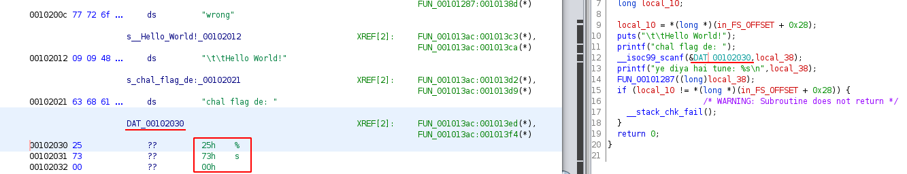

We can clean this up by highlighting those bytes and defining it as a string.

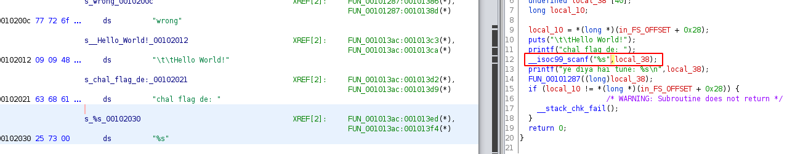

Now we can clearly see that the function is reading our input in and then passing it along to another function which we can assume will check our input to see if it is correct.

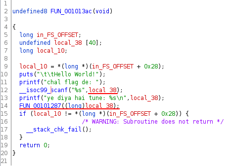

After looking at the function for a little, it looks like its doing two things: encoding our input in some way and then checking the encoded input.

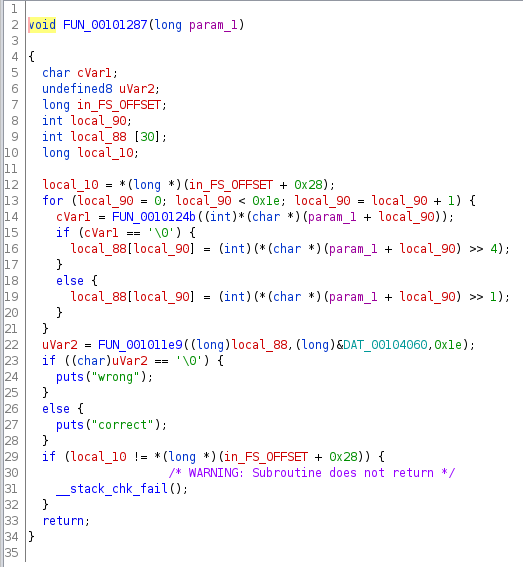

Cleaning this up will help a bit:

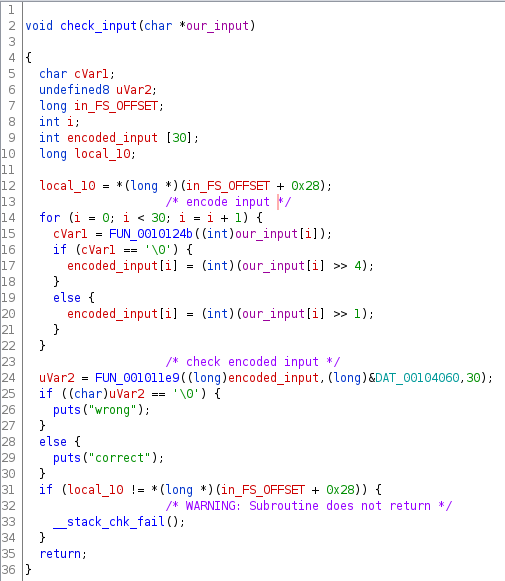

Now we can see that it encodes our input one character at a time based on the result of some function that we'll take a look at next.
We can also infer that the length of our input should be 30 characters.

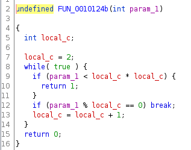

This looks like a simple implementation of a prime checking function so I'll rename this function so the encoding steps are easier to read.

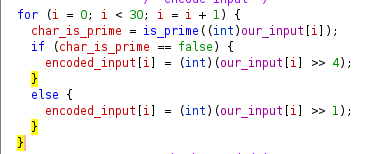

Now we can clearly see that it checks each character of our input and checks whether it is prime.
If it is prime it encodes that character by bitshifting it to the right by one.
It it's not prime it bitshifts it to the right by 4.

After our input has been encoded it then passes it to another function with a few parameters.
Two of the parameters are known to us: the encoded input and the length which is 30.
The other value is a pointer to a global variable.

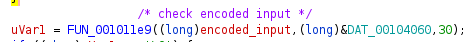

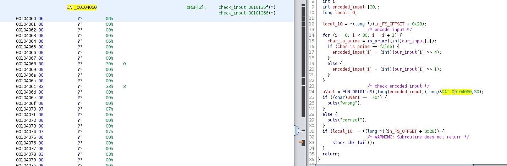

When I first attempted to reverse this binary I didn't really know what to do with those values so at this point I moved on to using [radare](#radare-n00b-attempt).

### Radare (n00b) attempt

My methodology for finding out what the value of the global check value was relatively simple yet overly complicated at the same time.
My thoughts were that I could brute force a value that would pass the check by placing a breakpoint before two encoded values are compared, pulling out the encoded value, finding what that encoded value could be decoded to, and repeating until I had 30 characters.

My script consisted of the following:

- A `is_prime` function to check if a number is prime
  -  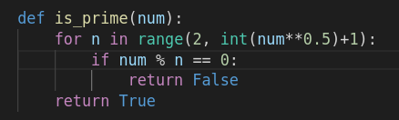
- An `encode` function that mimics the encoding logic within the binary
  -  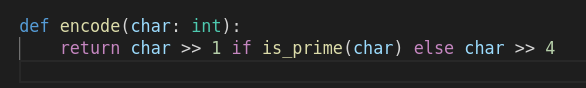
- A `decode` function that attempts to find a value within the printable character space that will encode to an expected value
  -  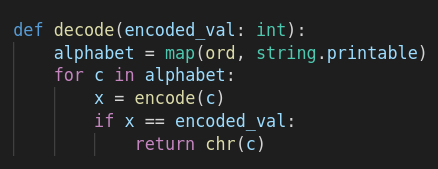
- The main logic of the script
  -  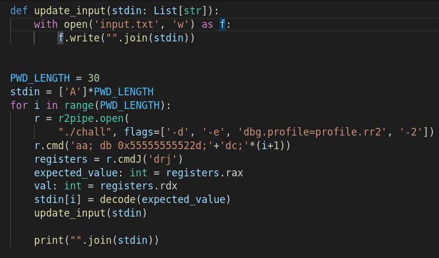

To explain the logic of the script a little better, I am using [r2pipe](https://www.radare.org/n/r2pipe.html) to debug the binary and run radare commands.
I open the binary in debug mode along with specifying a debug profile:

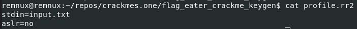

This profile just disables aslr and sets the stdin of the binary to the contents of `input.txt` which is initialized to 30 A's.

After the binary is loaded, I set a breakpoint on the instruction where the encoded values are compared:

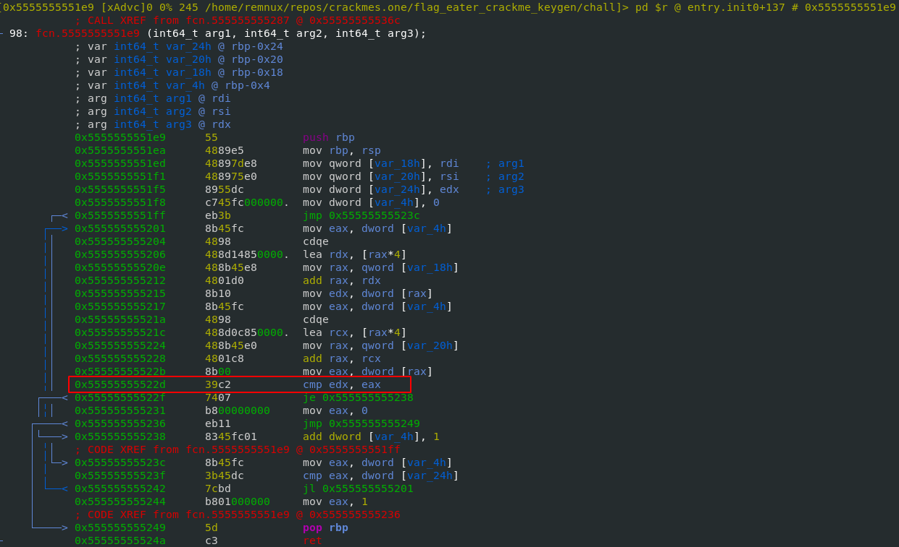

After doing some testing I figured out that the value we enter is contained within rdx and the expected/encoded value is held by rax.
I tested this by inputting the character Z as the input and saw that it got encoded as `0x5`.

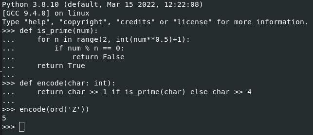

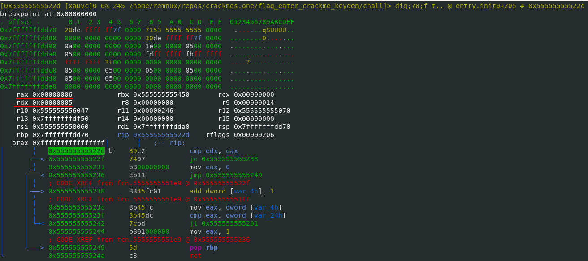

The script then continues execution of the binary until we hit the breakpoint and pulls out the values of rdx and rax.
It then computes a possible character based on the expected value using the `decode` function and updates our input file with that value.

NOTE: `cmdJ` will execute a command and parse its output as a python object. The r2 command `drj` prints the register values as json.

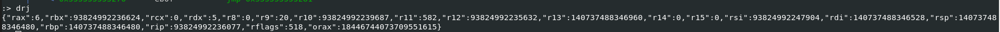

This then repeats until we've brute forced 30 characters that will pass the check.

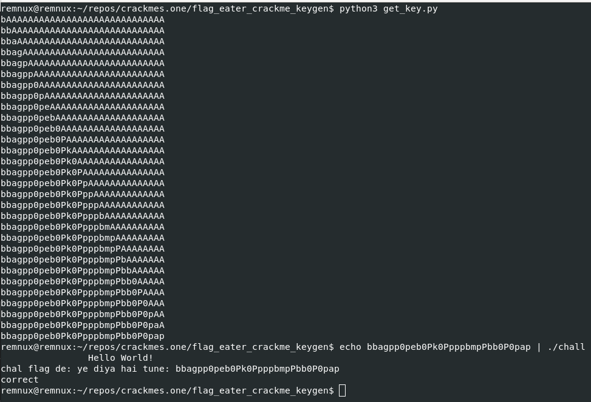

It wasn't till after I went through all this trouble that I realized I didn't have to debug the binary to figure out what the encoded values were.
I knew this in the back of my mind but it didn't click until I was messing around in radare a fair bit. 
The encoded values are contained directly within the binary and not the result of some computation so you should just be able to pull them out.
This caused me to revisit my static analysis in [ghidra](#revisiting-ghidra).

### Revisiting Ghidra

When I was initially examining the encoded value inside ghidra I forgot that you could define values as more than just strings. 
We know that the pointer to the global value is a list of 30 integers so let's simply decode that region as 30 ints.

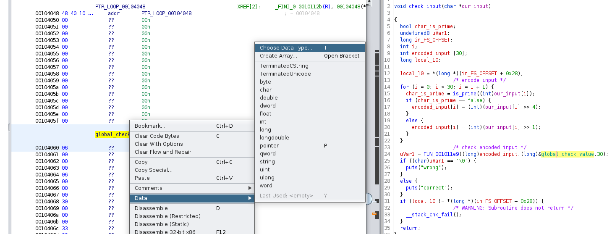

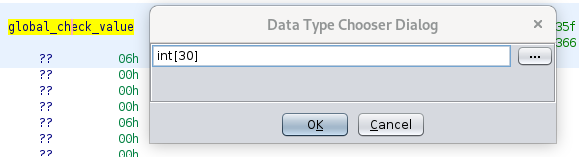

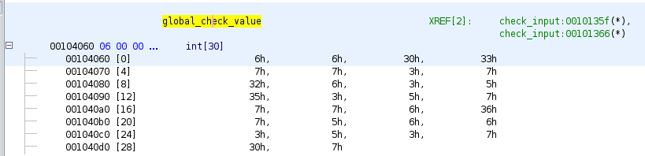

Now we can clearly see the 30 encoded values.
That means we can also easily extract these values using [radare](#radare-done-properly) and simplify the script a lot.

### Radare done properly

All we need to do is seek to the address of the encoded values and print them out.
To get a view similar to what we saw in ghidra we can use the command `px/30xw`:

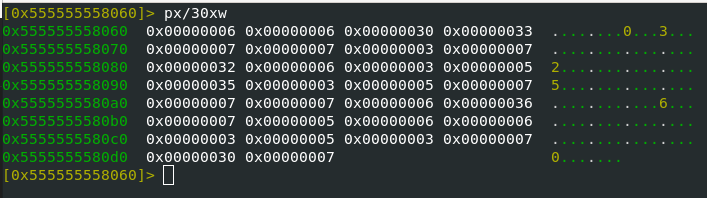

To print them as a json array we'll use the slightly different command `pxwj`. 
This prints more than we need though so we'll just grab the first 30 in the script.
Now the main logic of our script is as simple as:

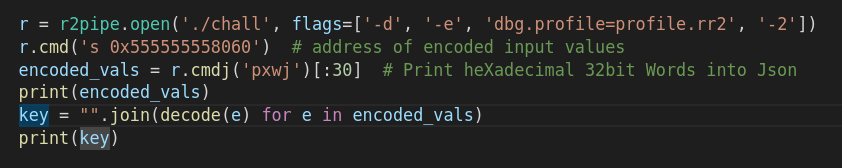

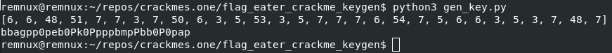

### All possible keys

By modifying the simple script from the [static radare](#radare-done-properly) methodology we can generate a visualization ([source](./gen_multiple_key_visualization.py)) of all possible keys (within the printable character range).

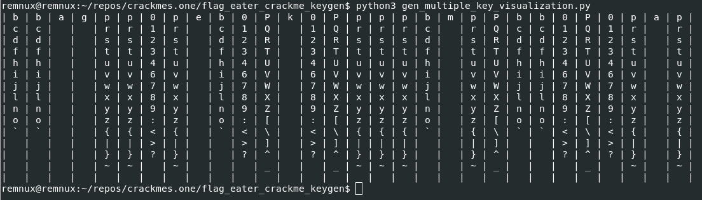

From this output we should be able to pick and choose whatever characters from each column and it would create a valid key.
We can also make the assumption that the first 4 letters of the "true" key (if there is one) are "flag".